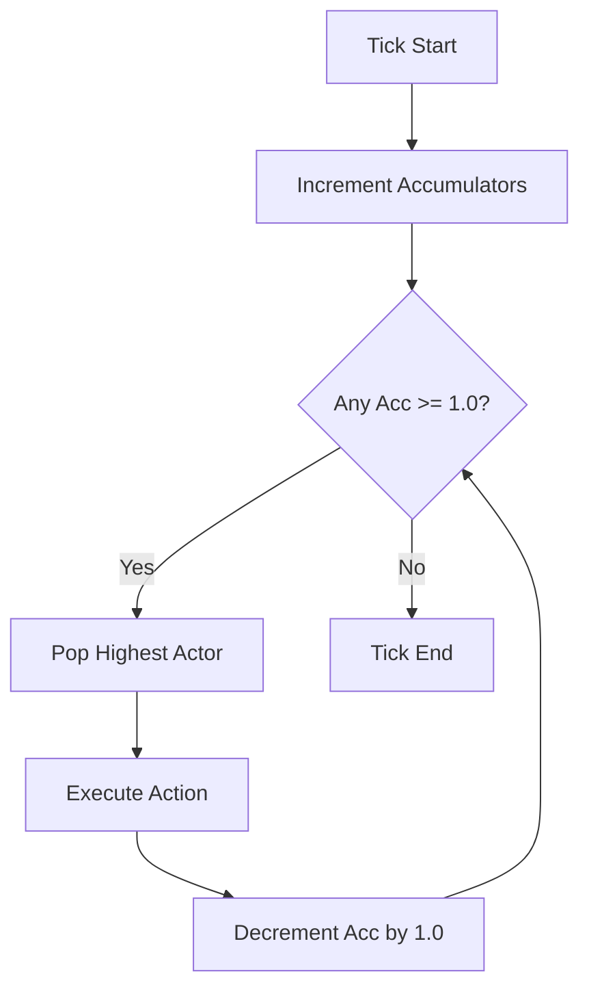

# COMBAT ENGINE ARCHITECTURE

This document outlines the core combat mechanics of Rakanishu, focusing on the deterministic logic and formula systems used by the engine.

## 1. Combat Loop & Turn Queue
The combat engine utilizes a **Weight-Based Accumulator** system for turn-queue determination, ensuring speed-based priority without non-deterministic side effects.

### 1.1 Turn Resolution
- **Accumulator Threshold**: `1.0`
- **Maximum Accumulator**: `10.0`
- **Tick Step**: At each tick, every actor's accumulator increases by `priority / maxPriority`.
- **Dispatcher**: The actor with the highest accumulator (>= 1.0) is popped. After taking an action, their accumulator is decremented by `1.0`.

## 2. Hit Opportunity (Accuracy Math)
Rakanishu uses a **Modified D2-Style Accuracy Formula** to calculate the chance of an attack landing.

### 2.1 Formula
The `calculateHitChance` function in `src/logic/combatUtils.ts` utilizes the following:

$$
HitChance = \left( \frac{AR}{AR + Def} \right) \times 2 \times \left( \frac{AttackerLvl}{AttackerLvl + DefenderLvl} \right)
$$

### 2.2 Constraints
> [!IMPORTANT]
> The hit chance is strictly clamped to ensure neither a 0% nor a 100% chance exists:
> - **Floor (Miss Cap)**: `0.05` (5%)
> - **Ceiling (Avoidance Cap)**: `0.95` (95%)

## 3. Damage Resolution
Damage is calculated by a gear-aware engine that incorporates RNG variance, Critical Strikes, and Mitigation.

### 3.1 Components
- **Base Range**: Determined by Gear/Monster level.
- **Critical Strike**:
  - Threshold: `15%` (Physical) | `25%` (Magic)
  - Multiplier: `2.5x` Damage
- **Mitigation**: `Damage - (Defense * 0.1)`
- **Immunities**: Resistance >= `100` results in `0` Damage.

---

*Ref: `src/logic/combatSystem.ts`, `src/logic/combatUtils.ts`*
